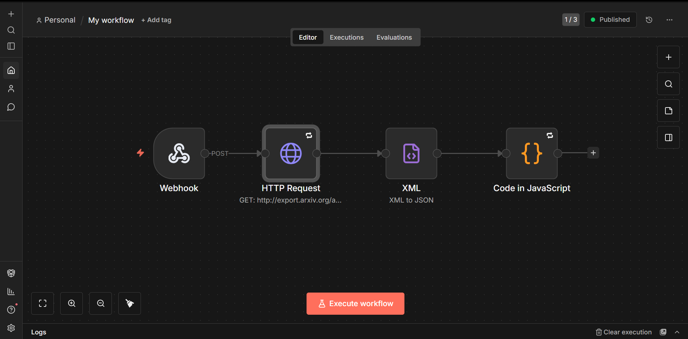

# 🚀 Automated Workflows with n8n

A simple automation system powered by **n8n** with a clean frontend that communicates via webhooks.

---

## 📌 Features

- 🔄 Automated workflows using n8n  
- 🌐 Webhook-based communication  
- 🎨 Clean Sage-Green UI  
- ⚡ Real-time data fetching  
- 🧩 Easy local setup  

---

## 🛠 Installation & Setup

### 1️⃣ Clone the Repository

```bash

git clone https://github.com/BigHero76/Automated-workflows.git
cd Automated-workflows
```


### 2️⃣ Install n8n (If Not Installed)
```bash
npm install -g n8n

```

### 3️⃣ Run n8n Locally
```bash
n8n


After running, open:
http://localhost:5678
```


### 🔗 Webhook Configuration




### 🔗 Webhook Configuration Commands
```bash
Your frontend communicates with n8n using a Webhook node.

Steps to Configure
Open your workflow in n8n

Click the Webhook node

Change the path from:

webhook-test
to:

webhook
(or any production-ready path)

Set HTTP Method → POST

Activate the workflow

```

### 🌍 Webhook URL Format
```bash
Update your frontend or external service to call:

https://your-n8n-domain/webhook/webhook
Example (local):

http://localhost:5678/webhook/webhook

```


### 💻 Frontend Structure
```bash
📂 Frontend
 ├── index.html   → Main layout
 ├── style.css    → Sage-green aesthetic styling
 └── script.js    → Fetches data from webhook & renders it

```

### ▶️ Run Frontend Locally
```bash
You can open it using:

VS Code Live Server

Any local web server

Or simply double-click index.html

The page automatically fetches data from your active webhook.
```

### 🧠 How It Works
```bash
Frontend → Webhook → n8n Workflow → Response → Rendered in UI
Frontend sends POST request

n8n workflow processes data

Webhook returns response

UI renders response dynamically
```

### 📦 Tech Stack
```bash
n8n
HTML
CSS
JavaScript
Node.js
```

### 📍 Future Improvements
```bash

Authentication layer

Environment variable support

Docker support(cloud support)

Error handling

Minimal student vibe User Interface 

```

